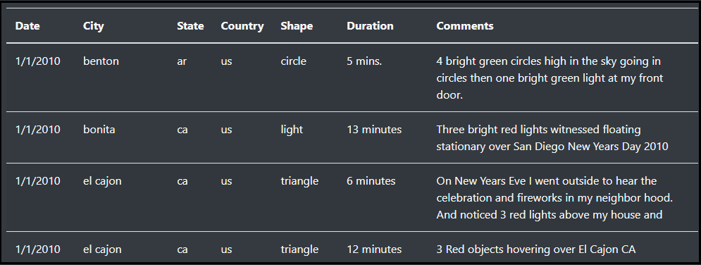
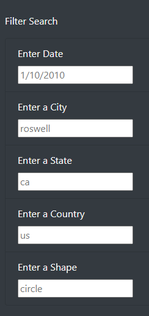
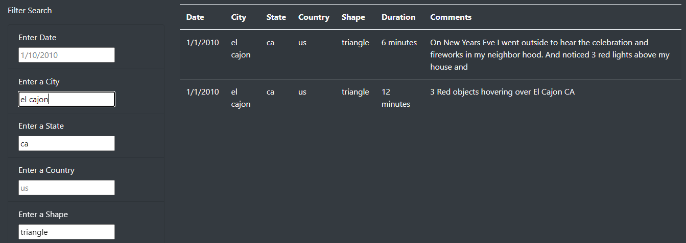
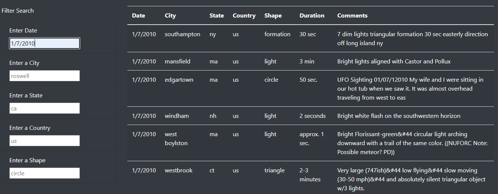

# UFOs
This project is based on Java Script. 

## Table of Contents
- [Project Overview](#OverviewProject)
  * [Background](#Background)
  * [Purpose](#purpose)
- [Results](#results)
- [Summary](#Summary)
- [Resources](#resources)
- [References](#references)

## Project Overview
### Background

In this project we are focussed on building a **dynamic webpage** that displays UFOs sightings information for upcoming annual gathering of UFO enthusiasts in McMinnville, Oregon. 
This webpage will accept User Inputs and visually adjust to reflect that interaction. We will build our dynamic pages by inserting JavaScript into an HTML page. We will also draw on our knowledge to CSS ad Bootstrap and explore some Chrome dev tools to test our code as we go.

  

### Purpose

The purpose of this project is to create a table to organize UFO data that is stored as JavaScript array or List. This table will have the ability to filter data based on certain criteria and will be created using JavaScript as the primary coding language.

For displaying the data on our webpage:

1. We will start by building a table to hold and neatly display the data. 
2. Add filters to that table which lets users refine their search on more than one level. We will use **JavaScript** to accomplish this task. 
3. The table will be inserted into and visually displayed by an HTML page. 
4. We will use basic **HTML, Bootstrap and CSS** to build and style the entire page. 
5. The webpage will include an **attention grabbing header, article summary and brief article**. Our end result will be a presentation of data that is both visually appealing and interactive.

 ## Results

* The first half of the webpage contains the title and a brief article about UFOs.

  

* The second half of the dynamic webpage allows user to view the UFO Sightings data stored in the JSON file [data.js](static/js/data.js) in the form of a table. 

  Below is a snap shot of the table displayed by default when no filters are selected:

  

* The User can filter data on various criteria such as ***Date, City, State, Country and Shape.***  
The date has to be dd/mm/yyyy format. If the date is not in proper format, the data will not be displayed on the table. 
The City, State, Country and Shape have to be entered in lower case. 

  

* When the user enters a search criteria as : 
City: el cajub
State: ca
Shape: triangle

The following data is displayed on the screen for the above search criteria.

  

* User can also filter data based on only one crtirea , for eg. Date.

When the user enters the below criteria:
Date: 1/7/2010

The following data is displayed on the screen for the above date entered by the user:

  

 

## Summary

We have successfully implemented the webpage and are able to filter our table based on the search criteria input by the user. However our webpage can be improved further for better user experience. First I would like to address some drawbacks of the webpage we have designed.

**Drawbacks:**
1. The data on the webpage is displayed all at once and the user has to scroll up and down to see the results.
2. The filters on the webpage- City, State, country and Shape-  are case sensitive. Hence when entering the search criteria, it should try to match it exactly with the data stored in the file. For eg. entering a city as 'benton' would display the result, however entering 'Benton' would not display any result.
3. The 'Date' filter on the webpage, has no date format validations. It does not restrict the user from entering the date in any other format except dd/mm/yyyy.
4. When there is no data available for the search criteria enetered by the user, we see a blank screen. This leaves the user a bit confused, wondering if he did something wrong.

**Recommendations:**
1. The table on the webpage should be designed to display only a certain amount of information. In order to see more information, there can be 'next' and 'previous' buttons to navigate back and forth from the page. This way the webpage would not be lengthy .
2. We can create our filters on the webpage to be non case sensitive and display the data.
3. We can add date format validations for our 'Date' filter, which would display error messages on the webpage if the user enters a date different from dd/mm/yyyy format.
4. When there is no data to be displayed on the screen for the search criteria entered by the user, we can display an appropriate message to inform the user.

##  Resources
[1] [Data File](static/js/data.js)  
[2] [Java Script Code](static/js/app.js)  
[3] [HTML file for webpage](index.html)  
[4] [CSS file for styling](static/css/style.css)  

[5] Software: 
* VSCode  
* Chrome Developer Tools  

[6] Languages: 
* JavaScript  
* HTML,CSS,Bootstrap3  

[7] Dependencies: 
* D3 library

##  References 
[1] [Interactive JavaScript Cheat Sheet](https://htmlcheatsheet.com/js/)  
[2] [Scrimba Intro to JavaScript](https://scrimba.com/g/gintrotojavascript)

 

